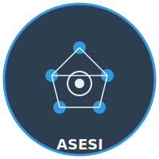

# 🤖 Swarm Visual — Enxame de Agentes IA

<p align="center">
  
  &nbsp;&nbsp;&nbsp;
  
  &nbsp;&nbsp;&nbsp;
  
</p>

<p align="center">
  <strong>CGE</strong> · Controladoria Geral do Estado &nbsp;|&nbsp;
  <strong>USJ</strong> · Universidade São José &nbsp;|&nbsp;
  <strong>ASESI</strong> · Assessoria Especial de Sistemas de Informação
</p>

---

<p align="center">
  
</p>

<h3 align="center">🎖 Robô Nordestino Chinês</h3>
<p align="center"><em>Mascote do projeto — combina a força do cangaceiro nordestino com a sabedoria tecnológica oriental</em></p>

---

## 📋 Sobre o Projeto

**Swarm Visual** é o painel de visualização do enxame de agentes IA que coordena tarefas do projeto USJ/ASESI/CGE. A interface mostra em tempo real:

- 🐝 **Enxame de Agentes** — robôs especializados (Dev, BD, Front, Back, DevOps, Design) trabalhando em paralelo
- 📊 **Kanban Board** — quadro de tarefas com movimentação automática pelos agentes
- 🔌 **MCP Servers** — integração com servidores Model Context Protocol
- 📜 **Logs em Tempo Real** — acompanhamento das ações do enxame

## 🏛️ Instituições

### CGE — Controladoria Geral do Estado


Órgão responsável pelo controle interno, auditoria e fiscalização da administração pública estadual. O projeto visa otimizar processos de governança e conformidade através de agentes inteligentes.

<br clear="left" />

### USJ — Universidade São José


Parceria acadêmica com a Universidade São José de Macau, trazendo expertise em pesquisa e inovação tecnológica, especialmente em inteligência artificial e processamento de linguagem natural.

<br clear="left" />

### ASESI — Assessoria Especial de Sistemas de Informação


Unidade responsável pela infraestrutura de sistemas de informação, coordenando a implementação técnica dos agentes IA e integrações com os sistemas existentes.

<br clear="left" />

---

## 🚀 Tecnologias

- **React 19** + TypeScript
- **Vite** (bundler)
- **Tailwind CSS 4** (estilização)
- **Framer Motion** (animações)
- **Recharts** (gráficos)
- **MCP** (Model Context Protocol)

## 🛠️ Como Executar

```bash
# Instalar dependências
npm install

# Iniciar servidor de desenvolvimento
npm run dev

# Build para produção
npm run build
```

## 📁 Estrutura

```
swarm-visual/
├── public/
│   ├── logo-cge.svg          # Logo CGE
│   ├── logo-usj.svg          # Logo USJ
│   ├── logo-asesi.svg        # Logo ASESI
│   └── robo-nordestino-chines.png  # Mascote
├── src/
│   ├── App.tsx               # Componente principal
│   ├── App.css               # Estilos
│   ├── assets/
│   │   └── robo-nordestino-chines.png
│   └── main.tsx
├── package.json
└── vite.config.ts
```

---

<p align="center">
  
  &nbsp;
  
  &nbsp;
  
  &nbsp;&nbsp;
  <strong>USJ × CGE × ASESI</strong> — Inovação com IA para o Serviço Público
</p>
